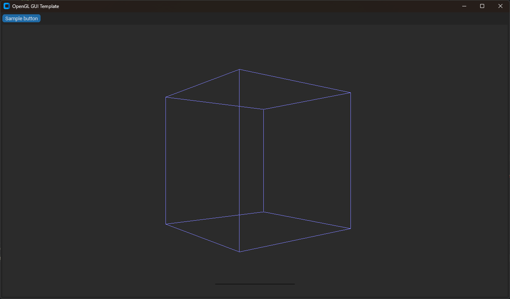

# OpenGL GUI Template

Welcome to OpenGL GUI Template. A template you can extend for works related to generating OpenGL generated graphics with customtkinter in a GUI based app.

## Prerequisites
- Make sure you have the latest version of Python installed on your system.
- (Optional) Create a virtual environment.

## Installation
1. Clone or download this repository to your local machine.
2. Open a terminal or command prompt and navigate to the project's root directory.

   ```shell
   cd path/to/opengl-gui-template

3. Install the required libraries from the requirements.txt file using pip:

   ```shell
   pip install -r requirements.txt

## Running the App

    python app.py

The App should now load and you should now be able to use the app

## Features

- Sample Button
- Sample 3D Cube rendering
- Simple easy to extend GUI

## Images



## Acknowledgements

- [CTkColorPicker](https://github.com/Akascape/CTkColorPicker): A much better color picker when it comes to UI than the default Tkinter color picker.
- [pyopengltk](https://github.com/jonwright/pyopengltk): Helped me to actually draw shapes on a tkinter frame using OpenGL. If it wasn't for this I would've moved on to use PyGame for the UI.

## License

This project is licensed under the MIT License - see the [LICENSE](LICENSE) file for details.

The MIT License is a permissive open-source license that allows users to freely use, modify, and distribute this software, subject to certain conditions. Users are granted the freedom to use the software for any purpose, including commercial purposes, without requiring payment or attribution to the original author.

Under the terms of the MIT License, users may modify the software and distribute derivative works, provided that the original copyright notice and permission notice are included in all copies or substantial portions of the software.

The MIT License imposes no additional restrictions on users beyond those specified in the license itself. It provides users with maximum flexibility while ensuring that the original author's copyright notice and disclaimer of liability are preserved.
